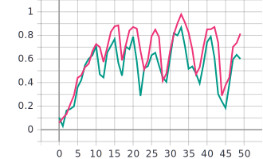

# Лабораторная работа №1
## С использованием примера[1] обучить представленную реализацию нейронной сети для решения задачи классификации изображений Oregon-Wild-Life
Описание архитектуры нейронной сети:
* Размерность входного изображения (224x224x3).
 ```
 inputs = tf.keras.Input(shape=(RESIZE_TO, RESIZE_TO, 3))
 ```
 * Слой 2D свертки. Параметры: 8 filteres, kernel_size=3 (матрица ядра = 3x3).
 ```
 x = tf.keras.layers.Conv2D(filters=8, kernel_size=3)(inputs) //размер выходного тензора 222*222*8
 ```
* Изменение формы тензора из многомерного в одномерный.
```
x = tf.keras.layers.Flatten()(x)
```
* Полносвязный Dense слой с 20 выходами и функцией активации softmax, которая определяет, к какой категории относится поданное на вход изображение.
```
outputs = tf.keras.layers.Dense(NUM_CLASSES, activation=tf.keras.activations.softmax)(x)
```
## Графики обучения для нейронной сети с одним сверточным слоем:
Синяя линия-на валидации, оранжевая линия-на обучении
* *График метрики точности*


* *График функции потерь*


## Анализ полученных результатов:
Исходя из полученных графиков, можно придти к выводу, что в ходе обработки изображений мы столкнулись с переобучением нашей нейронной сети, что связано с малым размером обучающей выборки.
## Создать и обучить сверточную нейронную сеть произвольной архитектуры с количеством сверточных слоев >3
Для решения данной задачи были добавлены три аналогичных дополнительных сверточных слоя Conv2D:
``` 
inputs = tf.keras.Input(shape=(RESIZE_TO, RESIZE_TO, 3))
x1 = tf.keras.layers.Conv2D(filters=8, kernel_size=3)(inputs)
x2 = tf.keras.layers.Conv2D(filters=8, kernel_size=3)(x1)
x3 = tf.keras.layers.Conv2D(filters=8, kernel_size=3)(x2)
x4 = tf.keras.layers.Conv2D(filters=8, kernel_size=3)(x3)
x5 = tf.keras.layers.MaxPool2D()(x4)
x6 = tf.keras.layers.Flatten()(x5)
outputs = tf.keras.layers.Dense(NUM_CLASSES, activation=tf.keras.activations.softmax)(x6)
```
## Графики обучения для нейронной сети с несколькими сверточными слоями:
Зелёная линия-на валидации, розовая линия-на обучении
* *График метрики точности*


*График функции потерь:*


## Анализ полученных результатов:
В данном случае изломанный график также, как в и первом случае, говорит о переобучении нейронной сети. Однако точность на порядок выше, как и значение функции потерь. Из графика точности наблюдается, что значение точности у сверточной нейронной сети с четырьмя слоями выше, чем у сверточной нейронной сети с одним сверточным слоем. Аналогично с графиком функции потерь относительно первого случая.
