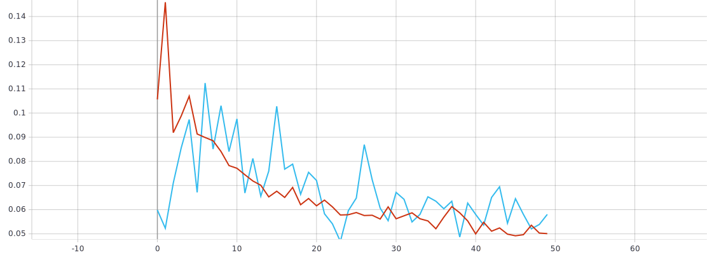
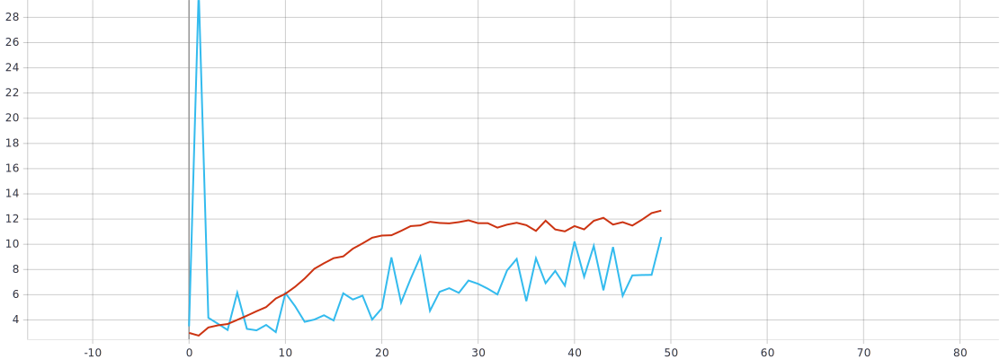
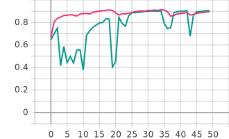
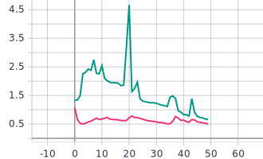

# Лабораторная работа №2
## С использованием примера обучить нейронную сеть EfficientNetB0 (случайное начальное приближение) для решения задачи классификации изображений Oregon WildLife

Описание архитектуры нейронной сети:
* Размерность входного изображения (224x224x3).
 ```
 inputs = tf.keras.Input(shape=(RESIZE_TO, RESIZE_TO, 3))
 ```
 * При использовании нейронной сети EfficientNetB0 на выходе получаем вероятность принадлежности изображения к определенному классу.
 ```
 outputs = EfficientNetB0(include_top=TЕrue, weights=None, classes=NUM_CLASSES)(inputs) // (None, 20)
 ```
* Для инициализации   

### Графики обучения для нейронной сети с рандомной инициализацией весовых коэффициентов:
Голубая линия-на валидации, красная линия-на обучении
* *График метрики точности*


* *График функции потерь*


### Анализ полученных результатов:
Полученные графики говорят о том, что нейронная сеть со случайным начальным приближением практически не обучилась.
## С использованием и техники обучения Transfer Learning обучить нейронную сеть EfficientNet-B0 (предобученную на базе изображений imagenet) для решения задачи классификации изображений Oregon WildLife
Для решения данной задачи мы используем уже готовый набор данных, обученный на 1000 изображений, следовательно, нам нужно изменить полносвязный слой так, чтобы его выход был не 1000 классов, а 20.
```
outputs = tf.keras.layers.Dense(NUM_CLASSES, activation=tf.keras.activations.softmax)(x)
```

### Графики обучения для нейронной сети, предобученной на базе изображений imagenet:
Зелёная линия-на валидации, розовая линия-на обучении
* *График метрики точности*


*График функции потерь:*


### Анализ полученных результатов:
В отличие от первого случая, график вышел достаточно правдоподобным. Этому поспособствовало изменение коэффициента скорости обучения до 0.0001 - меньший шаг коррекции весов для достижения большей точности.
