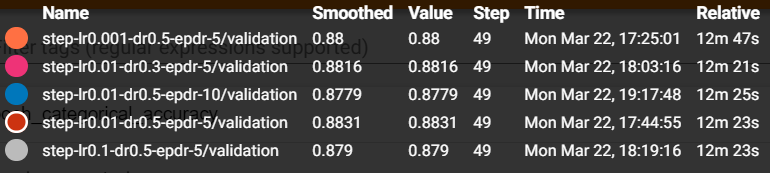
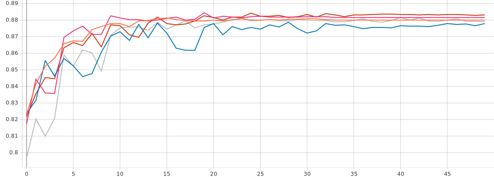
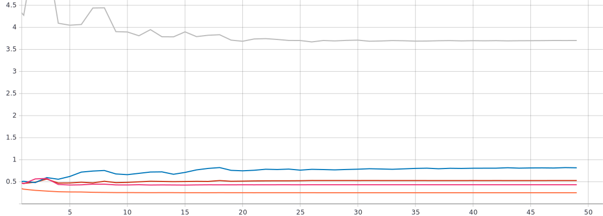

# Лабораторная работа №3
## С использованием [1] и техники обучения Transfer Learning обучить нейронную сеть EfficientNet-B0 (предварительно обученную на базе изображений imagenet) для решения задачи классификации изображений Oregon WildLife с использованием фиксированных темпов обучения 0.1, 0.01, 0.001, 0.0001

### Графики обучения для предобученной нейронной сети EfficientNet-B0 с фиксированным темпом обучения 0.1, 0.01, 0.001, 0.0001:

* *График метрики точности*

* *График функции потерь*

* Из графиков наблюдается оптимальный темп обучения lr = 0.001, при нём достигается наибольшая точность 87.84%, потери - 0.4349. 

## Реализовать и применить в обучении следующие политики изменения темпа обучения[2], а также определить оптимальные параметры для каждой политики:
* a. Пошаговое затухание (Step Decay)*
* b. Экспоненциальное затухание (Exponential Decay)*
### Графики обучения для предобученной нейронной сети EfficientNet-B0 с политикой изменения темпа обучения - ** пошаговое затухание **

* *График метрики точности*

*График функции потерь:*

* Оптимальный вариант: начальное значение темпа обучения - 0.01 со снижением в 0.3 раза каждые 5 эпох. Эти параметры приводят к наивысшему значению метрики качества (89,17%), но это на 0,0036% меньше чем у алгоритма с оптимальным фиксированным темпом.

### Графики обучения для предобученной нейронной сети EfficientNet-B0 с политикой изменения темпа обучения - ** экспоненциальное затухание **

* *График метрики точности*

* *График функции потерь*

* Оптимальный вариант получается при lr = 0.1 при k = 0.5, где наиболее высокая точность(88.21%) и наименьшие потери (0.3678). 
### Анализ полученных результатов
* Из всех оптимальных вариантов самое высокое значение метрики качества (%) наблюдается при .
*
*
