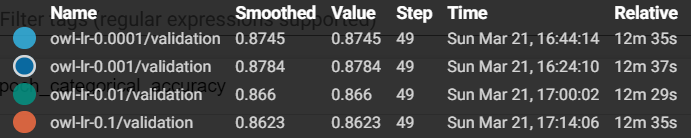
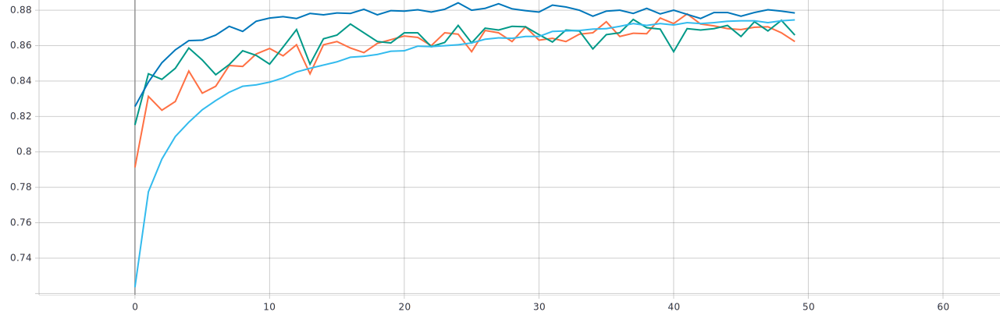
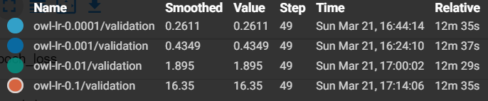
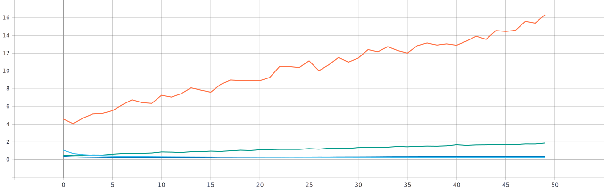
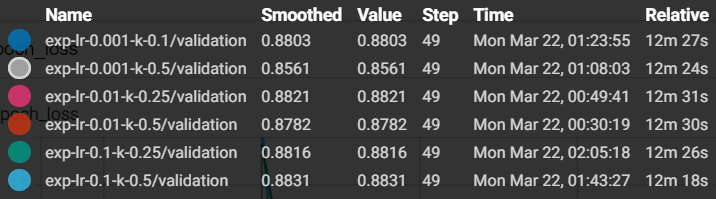
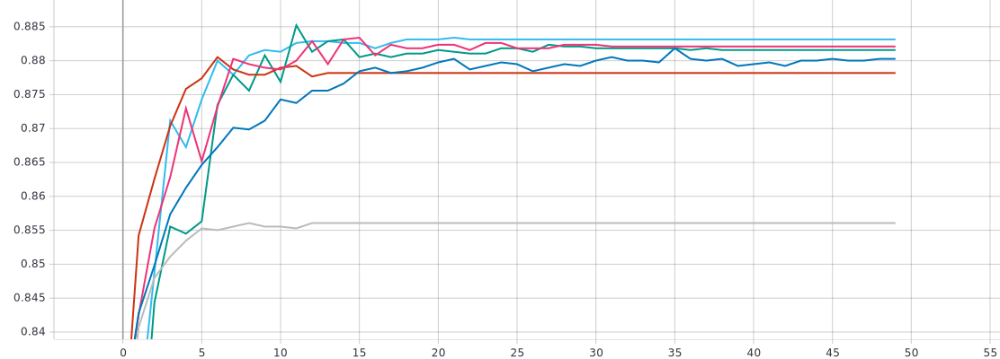
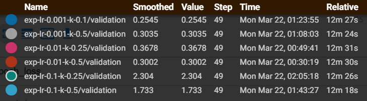
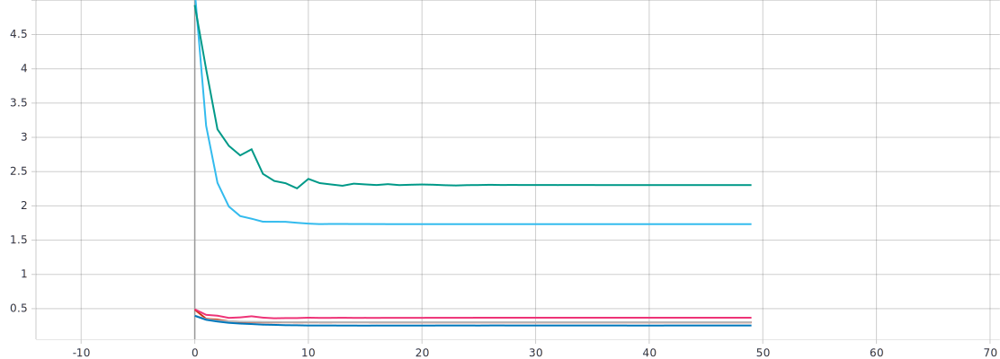

# Лабораторная работа №3
## С использованием [1] и техники обучения Transfer Learning обучить нейронную сеть EfficientNet-B0 (предварительно обученную на базе изображений imagenet) для решения задачи классификации изображений Oregon WildLife с использованием фиксированных темпов обучения 0.1, 0.01, 0.001, 0.0001

### Графики обучения для предобученной нейронной сети EfficientNet-B0 с фиксированным темпом обучения 0.1, 0.01, 0.001, 0.0001:

* *График метрики точности*

* *График функции потерь*

### Анализ полученных результатов
Исходя из графиков, можно придти к выводу, что оптимальный темп обучения - 0.001, при нём достигается наибольшая точность 87,84%. 

## Реализовать и применить в обучении следующие политики изменения темпа обучения[2], а также определить оптимальные параметры для каждой политики:
* a. Пошаговое затухание (Step Decay)*
* b. Экспоненциальное затухание (Exponential Decay)*
### Графики обучения для предобученной нейронной сети EfficientNet-B0 с политикой изменения темпа обучения - ** пошаговое затухание **
* *График метрики точности*

* *График функции потерь*

### Анализ полученных результатов
Исходя из графиков, можно придти к выводу, что оптимальный темп обучения - 0.01 и k=0.25 , при нём достигается наибольшая точность 87,84%. 
### Графики обучения для предобученной нейронной сети EfficientNet-B0 с политикой изменения темпа обучения - ** экспоненциальное затухание **

* *График метрики точности*

*График функции потерь:*

### Анализ полученных результатов:

