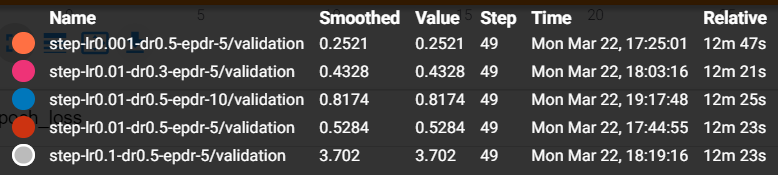
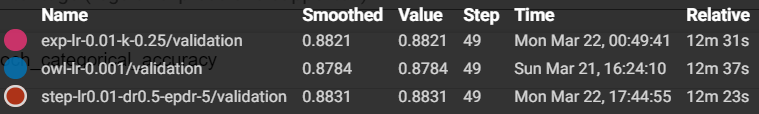
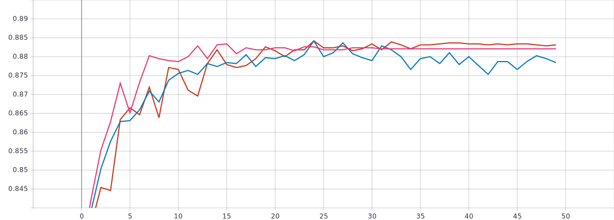
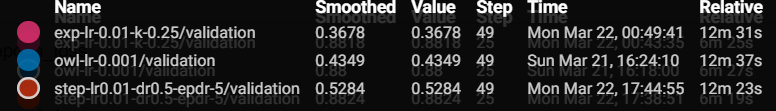
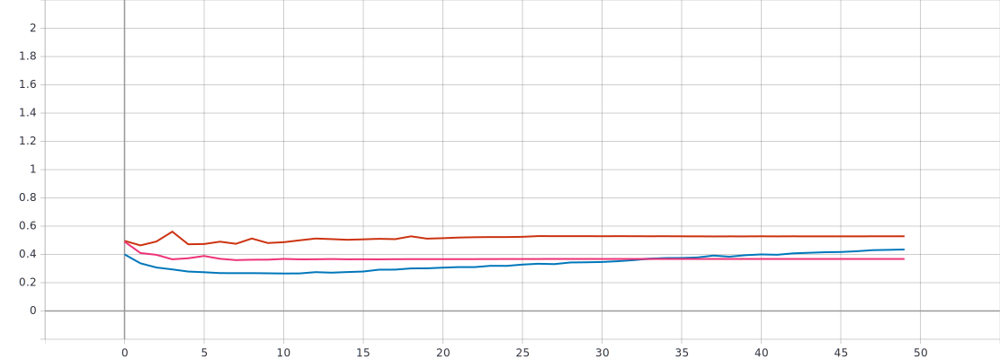

# Лабораторная работа №3
## С использованием [1] и техники обучения Transfer Learning обучить нейронную сеть EfficientNet-B0 (предварительно обученную на базе изображений imagenet) для решения задачи классификации изображений Oregon WildLife с использованием фиксированных темпов обучения 0.1, 0.01, 0.001, 0.0001

### Графики обучения для предобученной нейронной сети EfficientNet-B0 с фиксированным темпом обучения 0.1, 0.01, 0.001, 0.0001:

* *График метрики точности*

* *График функции потерь*

* Из графиков наблюдается оптимальный темп обучения lr = 0.001, при нём достигается наибольшая точность 87.84%, потери - 0.4349. 

## Реализовать и применить в обучении следующие политики изменения темпа обучения[2], а также определить оптимальные параметры для каждой политики:
* a. Пошаговое затухание (Step Decay)
* b. Экспоненциальное затухание (Exponential Decay)
### Графики обучения для предобученной нейронной сети EfficientNet-B0 с политикой изменения темпа обучения - пошаговое затухание

* *График метрики точности*

* *График функции потерь:*

* Оптимальный вариант: начальное значение темпа обучения - 0.01 со снижением в 0.5 раза каждые 5 эпох. При этом точность равняется 88.31%, потери - 0.5284.
### Графики обучения для предобученной нейронной сети EfficientNet-B0 с политикой изменения темпа обучения - экспоненциальное затухание

* *График метрики точности*

* *График функции потерь*

* Оптимальный вариант получается при lr = 0.001 при k = 0.25, где наиболее высокая точность(88.21%) и наименьшие потери (0.3678). 
### Анализ полученных результатов
* *График метрики точности*

* *График функции потерь*

* Коротко о каждом обучении:

 При фиксированном темпе обучении(lr = 0.001): точность 87.84%, потери - 0.4349. 
 При пошаговом затухании: точность 88.31%, потери - 0.5284.
 При экспоненциальном затухании: точность 88.21%, потери - 0.3678.
* Из всех оптимальных вариантов самое высокое значение метрики качества наблюдается при пошаговом затухании- 88.31%, что на 0.1% выше, чем при экспоненциальном затухании и на 0.47% выше, чем при фиксированном темпе обучения.
* Из графика функции потерь можно сделать вывод, что лучшие показатели у экспоненциального затухания - 0.3678, что на 0.0671 лучше, чем при пошаговом затухании, и на 0.1606, чем при пошаговом затухании.
* Самая высокая скорость сходимости появляется в случае экспоненциального затухания - алгоритм сошёлся к 17-й эпохе.
* Вывод: обучение с политикой изменения темпа - *экспоненциальное затухание* в совокупности показало лучшие результаты.
