# Лабораторная работа №4
## С использованием [1], техники обучения Transfer Learning [2] и оптимальной политики [3] изменения темпа обучения обучить нейронную сеть EfficientNet-B0(предварительно обученную на базе изображений imagenet) для решения задачи классификации изображений Oregon WildLife с использованием следующих техник аугментации данных [4]:

* При использовании политики изменения темпа обучения с экспоненциальным затуханием без аугментации данных мы получили точность равную 88.21%, потери - 0.3678.

## a. Манипуляции с яркостью и контрастом 
## Графики обучения для предобученной нейронной сети EfficientNet-B0 с использованием оптимальной политики изменения темпа обучения и манипуляций по изменению яркости и контраста:

* *График метрики точности*

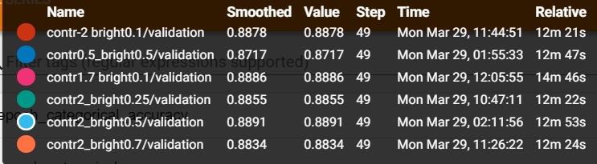
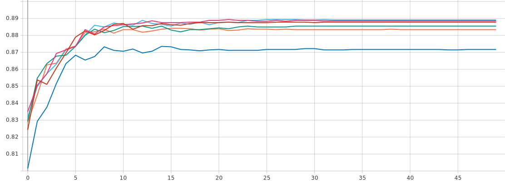

* *График функции потерь*

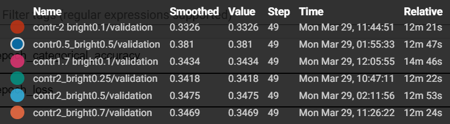
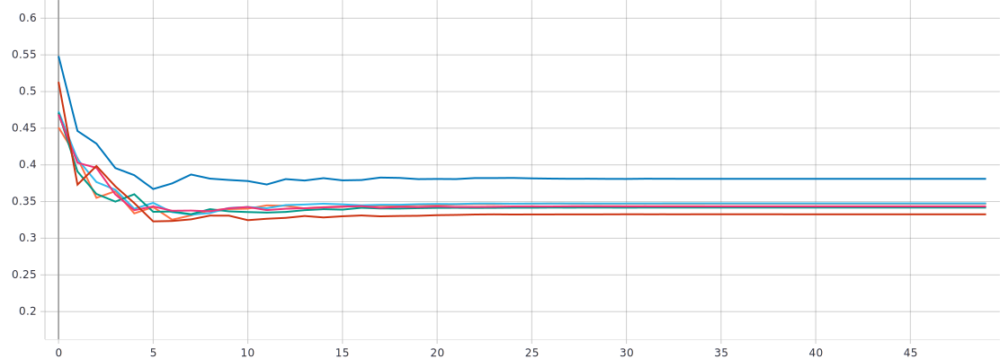

* При изменении контраста и яркости оптимальный результат был показан при контрасте равном 1.7 и яркости равной 0.1. В данном случае точность равна 88.86%, потери - 0.3434, сошлось к 27 эпохе.

## b. Поворот изображения на случайный угол
## Графики обучения для предобученной нейронной сети EfficientNet-B0 с использованием оптимальной политики изменения темпа обучения и поворота изображений на случайный угол:

* *График метрики точности*

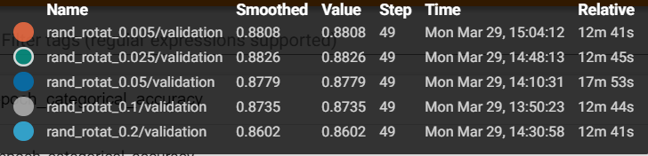
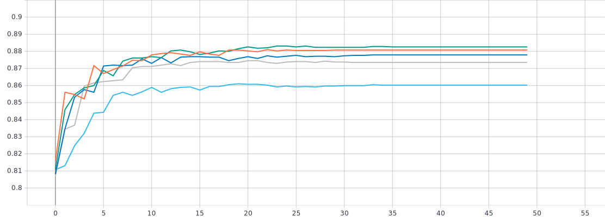

* *График функции потерь*

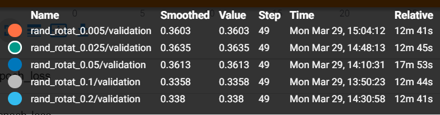
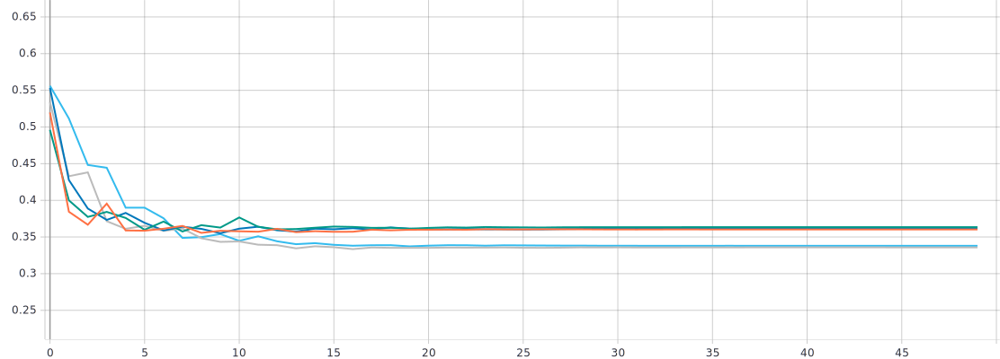

* При повороте на factor = 0.025, что для этого пункта лучший вариант, были получены точность 88.26% и потери 0.3635. Результат не улучшился.
## Влияние режимов заполнения для поворота изображения на случайный угол
* *График метрики точности*

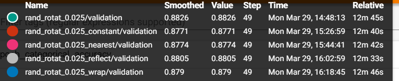
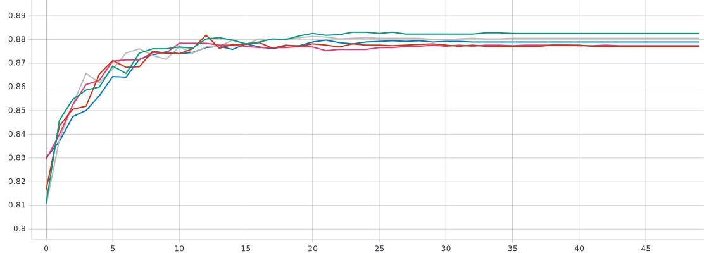

* *График функции потерь*

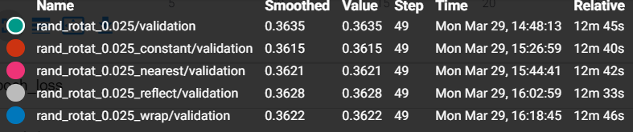
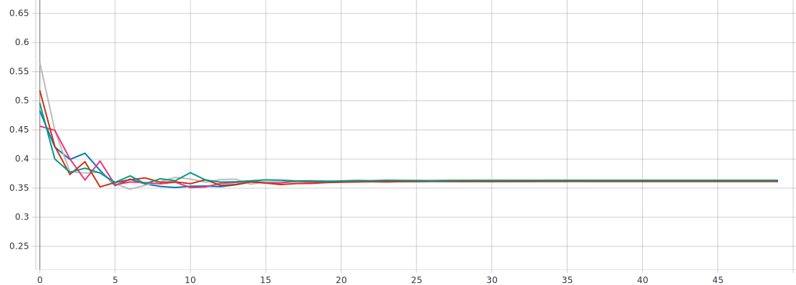

* Использование режимов заполнения положительно не повлияло на результат. Тем не менее, лучший среди режимов заполнения - reflect. Здесь точность составила 88.05%, потери- 0.3628.

## c. Использование случайной части изображения
## Графики обучения для предобученной нейронной сети EfficientNet-B0 с использованием оптимальной политики изменения темпа обучения и случайной части изображения:

* *График метрики точности*

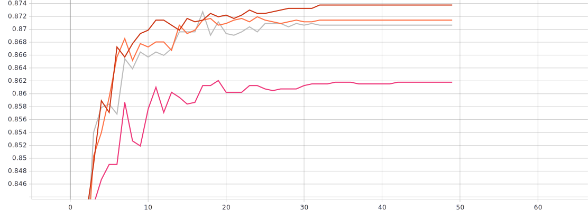

* *График функции потерь*

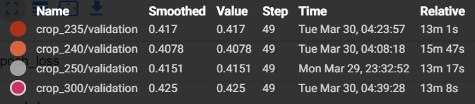
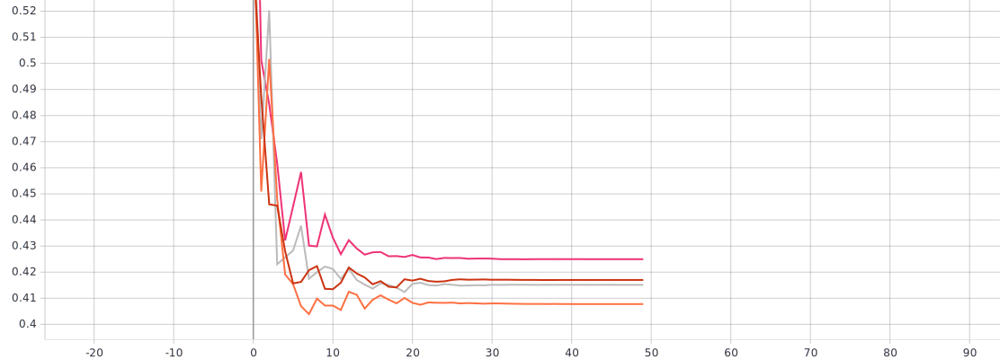

* 

## d. Добавление случайного шума 
## Графики обучения для предобученной нейронной сети EfficientNet-B0 с использованием оптимальной политики изменения темпа обучения и добавлением случайного шума:

* *График метрики точности*

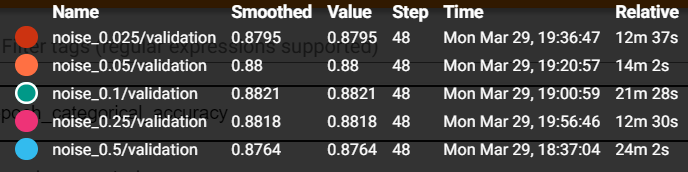
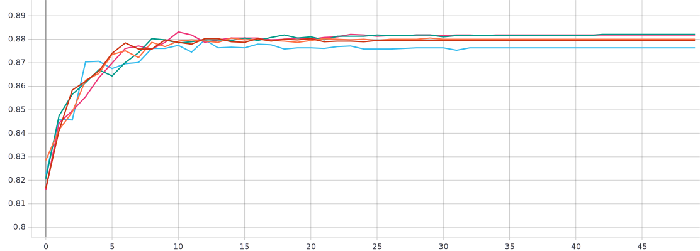

* *График функции потерь*

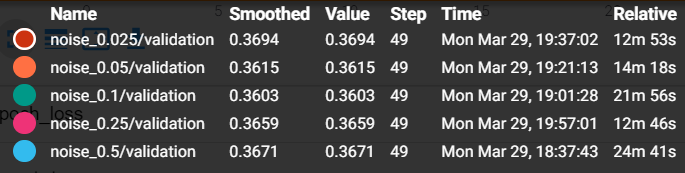
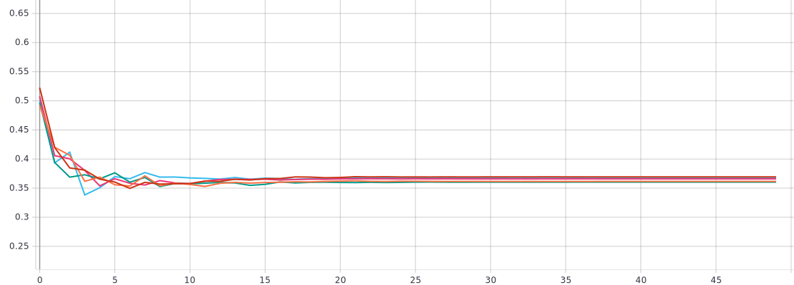

* Наилучший результат наблюдается при значении среднеквадратичного отклонения добавляемого шума, равном 0.1. Точность составила 88.21%, потери - 0.3603. Результат не улучшился.

