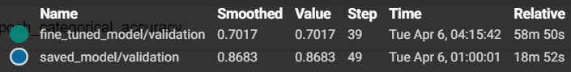
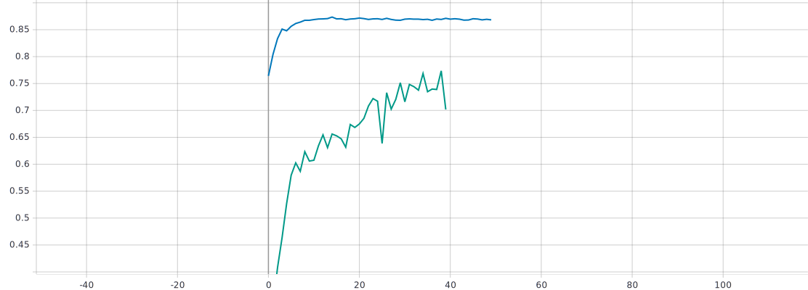
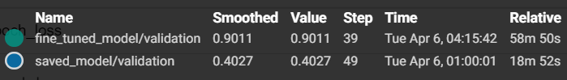
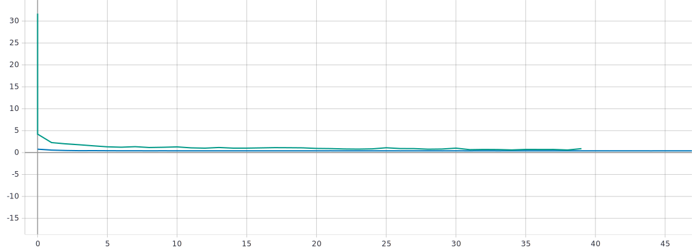

# Лабораторная работа №5
## С использованием техники обучения Transfer Learning, оптимальной политики изменения темпа обучения, аугментации данных с оптимальными настройками обучить нейронную сеть EfficientNet-B0 (предварительно обученную на базе изображений imagenet) для решения задачи классификации изображений Oregon WildLife.
Для решения поставленной задачи были использованы техники аугментации данных с оптимальными параметрами, определенными в предыдущих лабораторных работах:

Для яркости/контраста оптимальными параметрами были определены contrast_factor = 1.7, brightness = 1.
Для случайного вращения оптимальными параметрами были определены factor = (0, 0.025).
Для добавления случайного шума оптимальным параметром был определен stddev = 0.01, где stddev - значение среднеквадратичного отклонения добавляемого шума.
Для использования случайной части изображения оптимальными параметрами были определены resizing(235,235) RandomCrop(224,224).
В качестве оптимальной политики изменения темпа обучения была принята политика exp_decay с параметрами: initial_lrate = 0.01 и k=0.25.
## Графики обучения для предобученной нейронной сети EfficientNet-B0 с использованием оптимальной политики изменения темпа обучения и манипуляций по изменению яркости и контраста:
* *График метрики точности*

* *График функции потерь*

